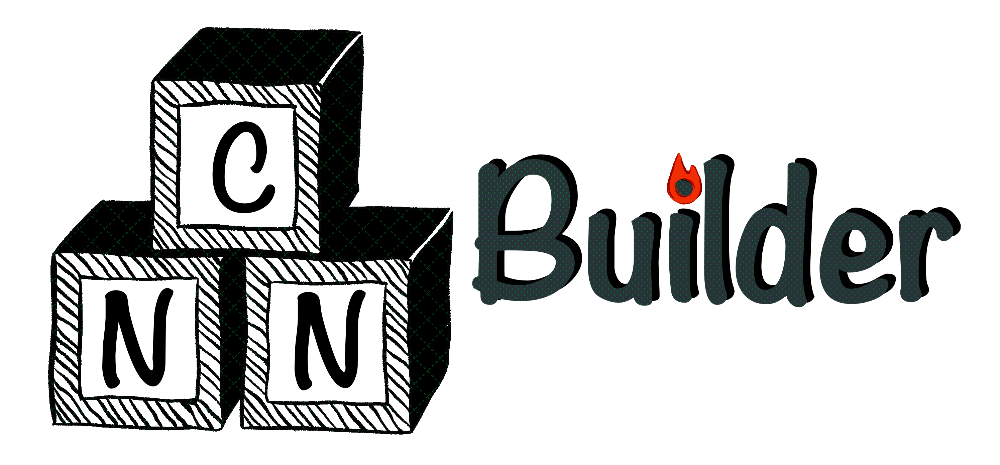

# TorchCNNBuilder
<p align="center">


</p>

<div id="badges">
    <a href="https://pytorch.org/">
        
    </a>
    
    <a href="https://badge.fury.io/py/torchcnnbuilder">
        
    </a>
</div>

---
**TorchCNNBuilder** — это фреймворк с открытым исходным кодом для автоматического 
создания архитектур CNN. В первую очередь он предназначен для исследователей, 
работающих с CNN, и берёт на себя большую часть написания кода архитектуры. 
Распространяется под **лицензией 3-Clause BSD**. 
Вся функциональность реализована исключительно на `pytorch` *(без сторонних зависимостей)*.

### Установка

---
Проще всего установить фреймворк через `pip`:
```
pip install torchcnnbuilder
```

<details><summary>Минимальные системные требования</summary>
Минимальными системными требованиями для использования библиотеки является
наличие интерпретатора Python версии >3.9 и доступ к вычислительной системе 
под управлением OC Windows/Linux. Минимальные требования к аппаратному обеспечению 
включают наличие процессора (CPU) с 8 ядрами, оперативной памяти (RAM) 2ГБ, 
хранилища HDD 2 ГБ, а также графического процессора (GPU) с 8 ГБ VRAM, поддерживающего версию CUDA не меньше 7.
</details>
<details><summary>Доп.пакеты для примеров</summary>

Обратите внимание, что при запуске примеров из папки [examples](examples) для визуализации 
и формирования набора данных используются дополнительные библиотеки:

```
pip install numpy
pip install pytorch_msssim
pip install matplotlib
pip install tqdm
```

Они не требуются для работы библиотеки, поэтому их установка не обязательна.

</details>

### Использование

Для инициализации простой модели с архитектурой "кодировщик-декодировщик" используйте класс ```ForecasterBase```:
```python
from torchcnnbuilder.models import ForecasterBase

model = ForecasterBase(input_size=[H, W],
                       in_time_points=C_in,
                       out_time_points=C_out,
                       n_layers=5)
```
Где ```[H, W]``` - размер изображения в пикселях, ```C_in``` - количество входных каналов, ```C_out``` - количество выходных каналов. 

Для раздельной работы с кодировщиком и декодировщиком их можно вызвать из модели:
```python
encoder = model.encoder
decoder = model.decoder
```

Для GPU-режима (device="cuda") возможно только использование видеокарт, поддерживающих версию CUDA >=7. 
В противном случае, доступен только CPU режим (необходимо задать device="cpu").

### Примеры

Сценарии использования можно найти в папке [examples](examples).

Примеры вызова компонентов — в папке [usage_examples](examples/usage_examples).


### Документация 

Документация доступна [по ссылке](https://chrislisbon.github.io/TorchCNNBuilder/torchcnnbuilder.html). 

### Разработчикам

Для просмотра доступных команд `Makefile` выполните в корне проекта: 
```sh
make help
```
```yaml
help: Показать справку по командам Makefile.
lint: Проверить код с помощью flake8.
doc: Собрать и запустить документацию локально.
```

### Направления прикладного использования

TorchCNNBuilder позволяет создавать CNN-архитектуры для различных практических задач:

#### Мониторинг окружающей среды

- **Прогнозирование концентрации морского льда**  
Предсказание ледовых условий в Арктике и Антарктике для климатических исследований и безопасности судоходства.

- **Прогнозирование климатических условий**  
Анализ атмосферных данных, а также их предсказание для оценки погодных явлений.

- **Прогнозирование уровня загрязнения**  
 Обработка данных сенсоров для предсказания и оценки качества воды и воздуха.

#### Дистанционное зондирование

- **Анализ спутниковых снимков**  
Обработка мультиспектральных изображений для сельского хозяйства и градостроительства.

- **Классификация подстилающей поверхности Земли**  
Автоматическое картирование территории на основе CNN, агрегирующей спектральную, пространственную и временную размерности данных.

- **Мониторинг природных бедствий**  
Системы детектирования изменений на основе оценки состояния природных сред по спутниковым изображениям до и после события. 
К примеру наводнений, пожаров или землетрясений.


#### Медицинские изображения

- **Автоматическая диагностика по рентгену/МРТ** 
Системы для обнаружения аномалий на медицинских изображениях, позволяющие сократить работу мед. персонала.

- **Сегментация опухолей**  
Создание 3D CNN для многомерного анализа медицинских данных.

- **Анализ медицинских временных рядов**    
Обработка потоковых данных для прогнозирования ухудшения состояния пациентов за счет временных признаков. 

#### Предиктивное обслуживание

- **Прогностическое обслуживание**
Мониторинг вибраций обоорудования и тепловых сигнатур для прогнозирования механических отказов.

- **Контроль качества на производстве**  
Внедрение систем визуального контроля в реальном времени, которые обнаруживают дефекты на производственных линиях.


#### Финансовое прогнозирование

- **Прогнозирование временных рядов**  
Создание гибридных архитектур CNN-LSTM, которые извлекают как пространственные 
закономерности из тепловых карт рынка, так и временные зависимости из истории цен.

- **Анализ рыночных тенденций** 
Обработка альтернативных пространственно-временных источников данных, таких как спутниковые снимки парковок или настроения в 
социальных сетях, с помощью архитектур CNN.


### Источники

---
- [Forecasting of Sea Ice Concentration using CNN, PDE discovery and Bayesian Networks](https://www.sciencedirect.com/science/article/pii/S1877050923020094)
- [Surrogate Modelling for Sea Ice Concentration using Lightweight Neural Ensemble](https://arxiv.org/abs/2312.04330)
- [Пост о разработке и применении фреймворка на habr.com ](https://habr.com/ru/companies/selectel/articles/818649/)


### Как поучаствовать в проекте

- Чтобы присоединиться к команде [напишите нам](mailto:jul.borisova@itmo.ru);

- [Issues](https://github.com/ChrisLisbon/TorchCNNBuilder/issues) и 
[Pull Requests](https://github.com/ChrisLisbon/TorchCNNBuilder/pulls): для пометки багов и запросов на добавление функций.

### Благодарности

Проект реализуется при поддержке [ФСИ](https://fasie.ru/) - Фонда содействия инновациям.