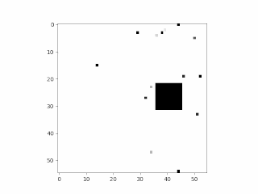
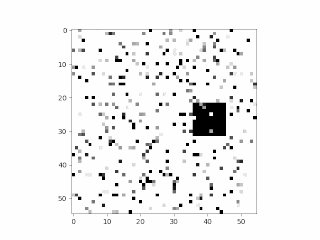
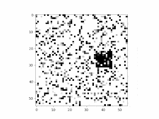

[[Click For Russian version]](README_RU.md)

### Experimental setup for noise synthetic video prediction

Imitation of noise in 1%, 3%, 5%, 10%, 25% 50%:

<p float="left">






</p>

Models train script with grid of experiments: [``` grid_train.py```](grid_train.py)

Tools for data generation and logging: [``` tools.py```](tools.py)

Notebook with results visualization: [``` results.ipynb```](results.ipynb)

For separated training of the best setup excluding grid of experiments  script [```best_train.py```](best_train.py)
can be used. Part of the output of this script is in [```best model```](best%20model) folder for clarity. 
