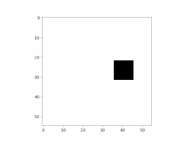
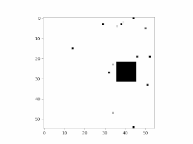
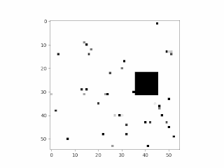
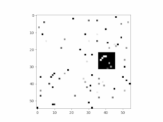
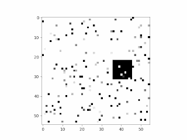
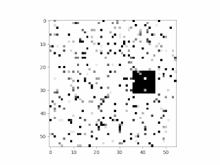
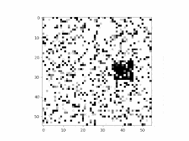

### Эксперимент по подбору архитектуры и оценки устойчивости к шуму

На изображениях представлены примеры зашумленных синтетическиз данных с уровнями шума 1%, 3%, 5%, 10%, 25% 50%:

<p float="left">







</p>

- Для запуска примера требуется запустить сетку экспериментов 
с обучением различных архитектур, собранных с помощью библиотеки -  [``` grid_train.py```](grid_train.py).

- Обратите внимание, что вспомогательные функции, реализующие генерацию 
синтетических данных и логирование реализованы в файле [``` tools.py```](tools.py).

- Для оценки результатов обучения архитектур реализован блокнот с комментариями 
к ячейкам [``` results.ipynb```](results.ipynb).
